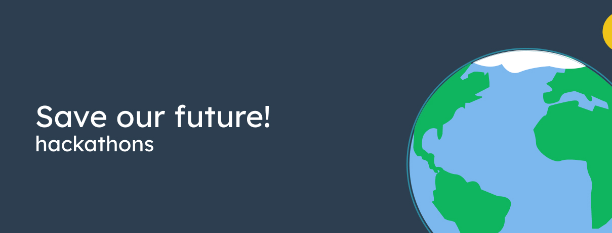

The idea: In this package you find all the resources needed as a hackathon organizer to start and promote a "Save our future" hackathon, to fight humanities biggest challanges of our time!

Want to support the development and stay updated?

 

Take a look at our online whiteboard: 

https://miro.com/app/board/o9J_kwt0Ekw=/
